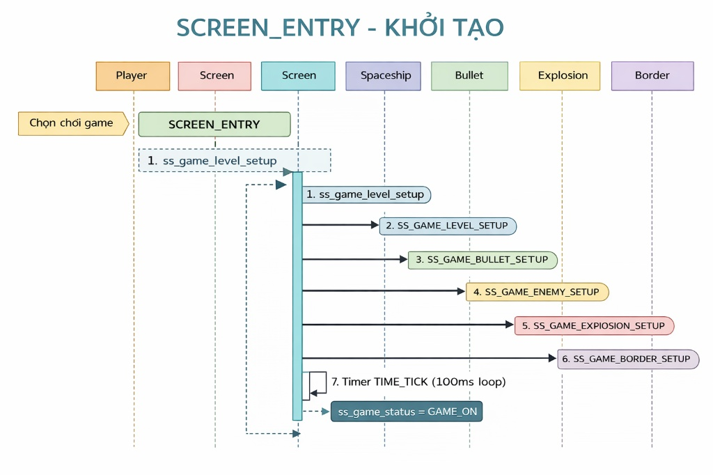
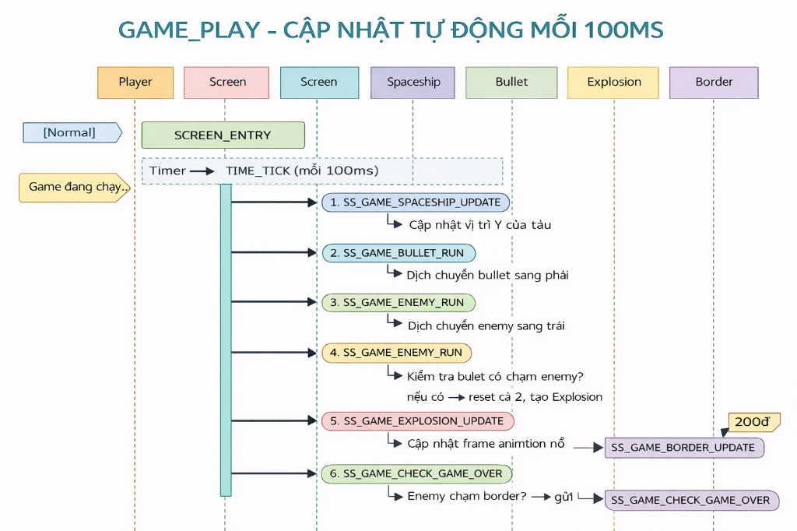
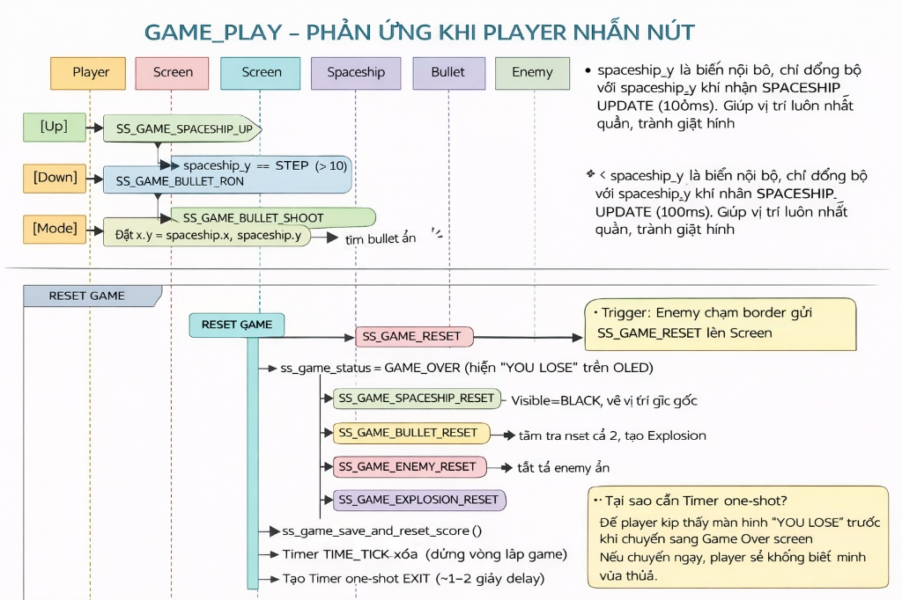
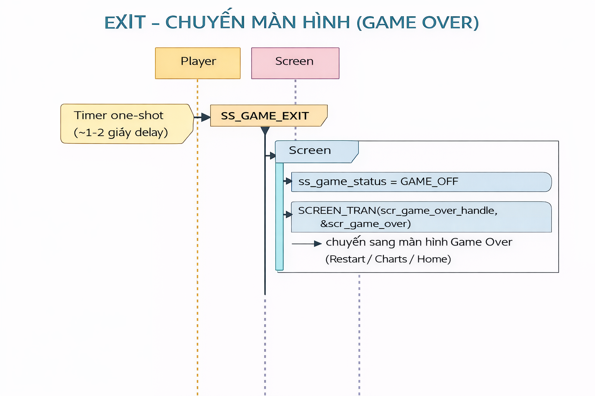

<div align="center">

# 🚀 Space Shooting Game
### Built on AK Embedded Base Kit · STM32L151

[](https://github.com/nguyentranhoangphuc13062004/Space-shooting)
[](https://epcb.vn/products/ak-embedded-base-kit-lap-trinh-nhung-vi-dieu-khien-mcu)
[](LICENSE)
[]()

</div>

https://github.com/user-attachments/assets/2cf365c7-6088-4c70-a695-e0a115350202

<hr>

## I. Giới thiệu

Space Shooting Game là một tựa game chạy trên AK Embedded Base Kit. Được xây dựng nhằm mục đích giúp các bạn có đam mê về lập trình nhúng có thể tìm hiểu và thực hành về lập trình event-driven. Trong quá trình xây dựng nên space shooting game, các bạn sẽ hiểu thêm về cách thiết kế và ứng dụng UML, Task, Signal, Timer, Message, State-machine,...

### 1.1 Phần cứng

<p align="center"></p>
<p align="center"><strong><em>Hình 1:</em></strong> AK Embedded Base Kit - STM32L151</p>

[AK Embedded Base Kit](https://epcb.vn/products/ak-embedded-base-kit-lap-trinh-nhung-vi-dieu-khien-mcu) là một evaluation kit dành cho các bạn học phần mềm nhúng nâng cao.

KIT tích hợp LCD **OLED 1.3", 3 nút nhấn, và 1 loa Buzzer phát nhạc**, với các trang bị này thì đã đủ để học hệ thống event-driven thông qua thực hành thiết kế máy chơi game.

KIT cũng tích hợp **RS485**, **NRF24L01+**, và **Flash** lên đến 32MB, thích hợp cho prototype các ứng dụng thực tế trong hệ thống nhúng hay sử dụng như: truyền thông có dây, không dây wireless, các ứng dụng lưu trữ data logger,...

#### Memory Map

| Địa chỉ | Vùng nhớ | Mô tả |
|---|---|---|
| `0x08000000` | **Boot** | [ak-base-kit-stm32l151-boot.bin](https://github.com/ak-embedded-software/ak-base-kit-stm32l151/blob/main/hardware/bin/ak-base-kit-stm32l151-boot.bin) |
| `0x08002000` | **BSF** | Shared memory giữa Boot và Application |
| `0x08003000` | **Application** | [ak-base-kit-stm32l151-application.bin](https://github.com/ak-embedded-software/ak-base-kit-stm32l151/blob/main/hardware/bin/ak-base-kit-stm32l151-application.bin) |

> 📐 **Schematic:** [schematic-ak-embedded-base-kit-version-3.pdf](https://github.com/ak-embedded-software/ak-base-kit-stm32l151/blob/main/hardware/schematic/schematic-ak-embedded-base-kit-version-3.pdf)  
> 🛒 **Mua kit:** [epcb.vn](https://epcb.vn/products/ak-embedded-base-kit-lap-trinh-nhung-vi-dieu-khien-mcu)

### 1.2 Mô tả trò chơi và đối tượng

Phần mô tả sau đây về **"Space Shooting Game"**, giải thích cách chơi và cơ chế xử lý của trò chơi. Tài liệu này dùng để tham khảo thiết kế và phát triển trò chơi về sau.

Trò chơi bắt đầu bằng màn hình **Menu game** với các lựa chọn sau:
- **Space Shooting Game:** Chọn vào để bắt đầu chơi game.
- **Setting:** Chọn vào để cài đặt các thông số của game.
- **Charts:** Chọn vào để xem top 3 điểm cao nhất đạt được.
- **Exit:** Thoát menu vào màn hình chờ.

#### 1.2.1 Các đối tượng (Object) trong game:

|Đối tượng|Tên đối tượng|Mô tả|
|---|---|---|
|**Tàu vũ trụ**|Spaceship|Di chuyển lên/xuống để chọn vị trí bắn ra đạn|
|**Đạn**|Bullet|Bắn ra từ tàu vũ trụ, dùng để tiêu diệt enemy|
|**Vụ nổ**|Explosion|Hiệu ứng xuất hiện khi enemy bị tiêu diệt|
|**Ranh giới**|Border|Vùng an toàn phải bảo vệ không cho enemy xâm phạm|
|**Kẻ địch**|Enemy|Vật thể bay về phía tàu vũ trụ với tốc độ tăng dần, có khả năng phá hủy ranh giới|

**(*)** Trong phần còn lại của tài liệu sẽ dùng tên của các đối tượng để đề cập đến đối tượng.

#### 1.2.2 Cách chơi game:
- Trong trò chơi này bạn sẽ điều khiển Spaceship, di chuyển **lên/xuống** bằng hai nút **[Up]/[Down]**, để chọn vị trí **bắn ra** Bullet.
- Khi nhấn nút **[Mode]** Bullet sẽ được bắn ra, nhằm tiêu diệt các Enemy đang bay đến.
- Mục tiêu trò chơi là kiếm được càng nhiều điểm càng tốt, trò chơi sẽ kết thúc khi có Enemy chạm vào Border.

#### 1.2.3 Cơ chế hoạt động:
- **Cách tính điểm:** Điểm được tính bằng số lượng Enemy bị tiêu diệt. Mỗi Enemy bị tiêu diệt tương ứng với 10 điểm. Số điểm tích lũy được sẽ hiển thị ở góc dưới bên phải màn hình.
- **Độ khó:** Mỗi khi tích lũy được 200 điểm, tốc độ bay của Enemy sẽ tăng lên một cấp độ. Độ khó ban đầu có thể cài đặt trong phần **Setting**.
- **Giới hạn của Bullet:** Khi bắn thì số lượng Bullet hiện có sẽ giảm đi tương ứng số lượng Bullet đang bay, nếu Bullet hiện có giảm về "0" thì không thể bắn được và sẽ có âm thanh báo. Số lượng Bullet hiện có sẽ được hồi lại khi tiêu diệt được Enemy hoặc Bullet bay hết màn hình game. Số lượng Bullet được hiển thị ở góc dưới bên trái màn hình và có thể thay đổi trong phần **Setting**.
- **Animation:** Để trò chơi thêm phần sinh động thì các đối tượng sẽ có thêm hoạt ảnh lúc di chuyển.
- **Kết thúc trò chơi:** Khi Enemy chạm vào Border, trò chơi sẽ kết thúc. Các đối tượng sẽ được reset và số điểm sẽ được lưu. Bạn sẽ vào màn hình "Game Over" với 3 lựa chọn là:
  - **Restart:** chơi lại.
  - **Charts:** vào xem bảng xếp hạng.
  - **Home:** về lại menu game.

## II. Thiết kế - SPACE SHOOTING GAME

**Các khái niệm trong event-driven:**

- **Event Driven:** Nôn na là một hệ thống gửi thư (gửi message) để thực thi các công việc. Trong đó, Task đóng vai trò là người nhận thư, Signal đại diện cho nội dung công việc. Task & Signal nền tảng của một hệ Event Driven.
- **Task:** Thông thường mỗi Task sẽ nhận một nhóm công công việc nào nào đó, ví dụ: quản lý state-machine, quản lý hiển thị của màn hình, quản lý việc cập nhật phần mềm, quản lý hệ thống watchdog ...
- **Message:** Được chia làm 2 loại chính, Message chỉ chứa Signal, hoặc vừa chứa Signal và Data. Message tương đương với Signal.
- **Handler:** Chỗ thực thi một công việc nào đó thì gọi là Handler.

Chi tiết các khái niệm các bạn tham khảo tại bài viết: [AK Embedded Base Kit - STM32L151 - Event Driven: Task & Signal](https://epcb.vn/blogs/ak-embedded-software/ak-embedded-base-kit-stm32l151-event-driven-task-signal)

### 2.1 Sơ đồ trình tự

**Sơ đồ trình tự** được sử dụng để mô tả trình tự của các Message và luồng tương tác giữa các đối tượng trong một hệ thống.
1. Tổng quan kiến trúc
Hệ thống hoạt động theo mô hình "ai cần việc thì nhắn tin, không ai chủ động gọi thẳng ai". Screen đóng vai trò bộ điều phối trung tâm, Timer là đồng hồ nhịp tim của game, các object (Spaceship, Bullet, Enemy...) chỉ phản ứng khi nhận được Signal.
Timer ──TIME_TICK──► Screen ──► gửi Signal đến từng Object
Button ─────────────► Screen ──► gửi Signal điều khiển
Object ─────────────► Screen ──► báo cáo khi cần reset/game over

2. Phân tích từng giai đoạn
GIAI ĐOẠN 1 — SCREEN_ENTRY (Khởi tạo)
Khi nào xảy ra: Lúc player chọn "Space Shooting Game" từ menu.
Flow từng bước:
1. Screen nhận SCREEN_ENTRY
2. Gọi ss_game_level_setup()     → load cấu hình difficulty từ Setting
3. Gửi SS_GAME_SPACESHIP_SETUP   → Spaceship về vị trí ban đầu, visible=WHITE
4. Gửi SS_GAME_BULLET_SETUP      → tất cả Bullet ẩn, visible=BLACK
5. Gửi SS_GAME_ENEMY_SETUP       → Enemy xuất hiện vị trí ngẫu nhiên bên phải
6. Gửi SS_GAME_EXPLOSION_SETUP   → tất cả Explosion ẩn
7. Gửi SS_GAME_BORDER_SETUP      → Border hiện ra bên trái
8. Khởi tạo Timer TIME_TICK 100ms lặp lại
9. ss_game_status = GAME_ON
Điểm thiết kế tốt: Tách biệt hoàn toàn việc setup từng object — nếu muốn thêm object mới chỉ cần thêm 1 signal SETUP, không đụng code cũ.

<p align="center">
  
</p>

GIAI ĐOẠN 2 — GAME PLAY (Vòng lặp game)
Đây là trái tim của game. Mỗi 100ms Timer bắn TIME_TICK vào Screen, Screen lần lượt điều phối toàn bộ hệ thống.

<p align="center">
  
</p>

GIAI ĐOẠN 3 — RESET GAME (Xử lý Game Over)
Trigger: Border phát hiện enemy.x ≤ border.x → gửi SS_GAME_RESET lên Screen.
B
Tại sao cần Timer one-shot? Để player kịp thấy màn hình "YOU LOSE" trước khi chuyển sang Game Over screen. Nếu chuyển ngay, player sẽ không biết mình vừa thua.

<p align="center">
  
</p>

GIAI ĐOẠN 4 — EXIT (Chuyển màn hình)
Timer one-shot ──SS_GAME_EXIT──► Screen
                                  │
                                  ├── ss_game_status = GAME_OFF
                                  └── SCREEN_TRAN(scr_game_over_handle, &scr_game_over)
                                       → chuyển sang màn hình Game Over
                                          (Restart / Charts / Home)

<p align="center">
  
</p>

### Ghi chú:

**SCREEN_ENTRY:** Cài đặt các thiết lập ban đầu cho đối tượng trong game.
- **Level setup:** Thiết lập thông số cấp độ cho game.
- **SS_GAME_SPACESHIP_SETUP:** Thiết lập thông số ban đầu cho đối tượng Spaceship
- **SS_GAME_BULLET_SETUP:** Thiết lập thông số ban đầu cho các đối tượng Bullet
- **SS_GAME_ENEMY_SETUP:** Thiết lập thông số ban đầu cho các đối tượng Enemy
- **SS_GAME_EXPLOSION_SETUP:** Thiết lập thông số ban đầu cho các đối tượng Explosion
- **SS_GAME_BORDER_SETUP:** Thiết lập thông số ban đầu cho đối tượng Border
- **Setup timer - Time tick:** Khởi tạo Timer - Time tick cho game.
- **STATE (GAME_ON):** Cập nhật trạng thái game -> GAME_ON

**GAME PLAY - Normal:** Game hoạt động ở trạng thái bình thường.
- **SS_GAME_TIME_TICK:** Signal do Timer - Time tick gửi đến.
- **SS_GAME_SPACESHIP_UPDATE:** Cập nhật trạng thái Spaceship.
- **SS_GAME_BULLET_RUN:** Cập nhật di chuyển của các Bullet theo thời gian.
- **SS_GAME_ENEMY_RUN:** Cập nhật di chuyển của các Enemy theo thời gian.
- **SS_GAME_ENEMY_DETONATOR:** Kiểm tra các Enemy có bị Bullet tiêu diệt.
- **SS_GAME_EXPLOSION_UPDATE:** Cập nhật hoạt ảnh vụ nổ theo thời gian.
- **SS_GAME_BORDER_UPDATE:** Kiểm tra số điểm hiện tại để cập nhật tăng độ khó game.
- **SS_GAME_CHECK_GAME_OVER:** Kiểm tra Enemy chạm vào Border. Nếu chạm vào thì gửi Signal - **SS_GAME_RESET** đến **Screen**.

**GAME PLAY - Action:** Game hoạt động ở trạng thái có tác động của các nút nhấn.
- **SS_GAME_SPACESHIP_UP:** Player nhấn nút **[Up]** điều khiển Spaceship di chuyển lên.
- **SS_GAME_SPACESHIP_DOWN:** Player nhấn nút **[Down]** điều khiển Spaceship di chuyển xuống.
- **SS_GAME_BULLET_SHOOT:** Player nhấn nút **[Mode]** điều khiển Spaceship bắn Bullet ra.

**RESET GAME:** Quá trình cài đặt lại các thông số trước khi thoát game.
- **STATE (GAME_OVER):** Cập nhật trạng thái game -> GAME_OVER
- **SS_GAME_SPACESHIP_RESET:** Cài đặt lại đối tượng Spaceship trước khi thoát.
- **SS_GAME_BULLET_RESET:** Cài đặt lại đối tượng Bullet trước khi thoát.
- **SS_GAME_ENEMY_RESET:** Cài đặt lại đối tượng Enemy trước khi thoát.
- **SS_GAME_EXPLOSION_RESET:** Cài đặt lại đối tượng Explosion trước khi thoát.
- **SS_GAME_BORDER_RESET:** Cài đặt lại đối tượng Border trước khi thoát.
- **Save and reset Score:** Lưu số điểm hiện tại và Cài đặt lại.
- **Timer remove - Timer tick:** Xóa Timer - Time tick.
- **Setup timer - Timer exit:** Tạo 1 timer one shot để thoát game.

**EXIT:** Thoát khỏi game và chuyển sang màn hình Game Over.
- **SS_GAME_EXIT:** Signal do Timer exit gửi đến.
- **STATE (GAME_OFF):** Cập nhật trạng thái game -> GAME_OFF
- **Change the screen - SCREEN_TRAN(scr_game_over_handle, &scr_game_over):** Chuyển màn hình sang màn hình Game Over.

### 2.2 Chi tiết

#### 2.2.1 Thuộc tính đối tượng

**Trạng thái** của một đối tượng được biểu diễn bởi các **thuộc tính**. Trong trò chơi này các đối tượng có các thuộc tính cụ thể là:
- **visible:** Quy định hiển thị, ẩn/hiện của đối tượng.
- **x, y:** Quy định vị trí của đối tượng trên màn hình.
- **action_image:** Quy định hoạt ảnh tạo animation.

Ví dụ:

    typedef struct {
        bool visible;
        uint32_t x, y;
        uint8_t action_image;
    } ss_game_spaceship_t;

    extern ss_game_spaceship_t spaceship;

**Áp dụng struct cho các đối tượng:**

|struct|Các biến|
|------|--------|
|ss_game_spaceship_t|spaceship|
|ss_game_bullet_t|bullet[MAX_NUM_BULLET]|
|ss_game_explosion_t|explosion[NUM_EXPLOSION]|
|ss_game_border_t|border|
|ss_game_enemy_t|enemy[NUM_ENEMIES]|

**(*)** Các đối tượng có số lượng nhiều thì sẽ được khai báo dạng mảng.

**Các biến quan trọng:**
- **ss_game_score:** Điểm của trò chơi.
- **ss_game_status:** Trạng thái của trò chơi.
  - GAME_OFF: Tắt.
  - GAME_ON: Bật.
  - GAME_OVER: Đã thua.
- **ss_game_setting_t** settingsetup: Cấu hình cấp độ của trò chơi.
  - settingsetup.silent: Bật/tắt chế độ im lặng.
  - settingsetup.num_bullet: Cấu hình số lượng đạn.
  - settingsetup.bullet_speed: Cấu hình tốc độ đạn.
  - settingsetup.enemy_speed: Cấu hình tốc độ của enemy.

## III. Hướng dẫn chi tiết code trong đối tượng

### 3.1 Spaceship

**Tóm tắt nguyên lý:** Spaceship sẽ nhận Signal được gửi từ 2 nguồn là Screen và Button. Quá trình xử lý của đối tượng phân làm 3 giai đoạn:
- **Giai đoạn 1:** Bắt đầu game, cài đặt các thông số của Spaceship như vị trí và hình ảnh.
- **Giai đoạn 2:** Chơi game, trong giai đoạn này chia làm 2 hoạt động là:
  - Cập nhật: Screen gửi Signal cập nhật cho Spaceship mỗi 100ms để cập nhật trạng thái hiện tại của Spaceship.
  - Hành động: Button gửi Signal di chuyển lên/xuống cho Spaceship mỗi khi nhấn nút.
- **Giai đoạn 3:** Kết thúc game, thực hiện cài đặt lại trạng thái của Spaceship trước khi thoát game.

**Code:**

    #include "ss_game_spaceship.h"

    ss_game_spaceship_t spaceship;
    static uint32_t spaceship_y = AXIS_Y_SPACESHIP;

    #define SS_GAME_SPACESHIP_SETUP() \
    do { \
        spaceship.x = AXIS_X_SPACESHIP; \
        spaceship.y = AXIS_Y_SPACESHIP; \
        spaceship.visible = WHITE; \
        spaceship.action_image = 1; \
    } while (0);

    #define SS_GAME_SPACESHIP_UP() \
    do { \
        spaceship_y -= STEP_SPACESHIP_AXIS_Y; \
        if (spaceship_y == 0) {spaceship_y = 10;} \
    } while(0);

    #define SS_GAME_SPACESHIP_DOWN() \
    do { \
        spaceship_y += STEP_SPACESHIP_AXIS_Y; \
        if (spaceship_y > 50) {spaceship_y = 50;} \
    } while(0);

    #define SS_GAME_SPACESHIP_RESET() \
    do { \
        spaceship.x = AXIS_X_SPACESHIP; \
        spaceship.y = AXIS_Y_SPACESHIP; \
        spaceship.visible = BLACK; \
        spaceship_y = AXIS_Y_SPACESHIP; \
    } while(0);

    void ss_game_spaceship_handle(ak_msg_t* msg) {
        switch (msg->sig) {
        case SS_GAME_SPACESHIP_SETUP: {
            APP_DBG_SIG("SS_GAME_SPACESHIP_SETUP\n");
            SS_GAME_SPACESHIP_SETUP();
        }
            break;

        case SS_GAME_SPACESHIP_UPDATE: {
            APP_DBG_SIG("SS_GAME_SPACESHIP_UPDATE\n");
            spaceship.y = spaceship_y;
        }
            break;

        case SS_GAME_SPACESHIP_UP: {
            APP_DBG_SIG("SS_GAME_SPACESHIP_UP\n");
            SS_GAME_SPACESHIP_UP();
        }
            break;

        case SS_GAME_SPACESHIP_DOWN: {
            APP_DBG_SIG("SS_GAME_SPACESHIP_DOWN\n");
            SS_GAME_SPACESHIP_DOWN();
        }
            break;

        case SS_GAME_SPACESHIP_RESET: {
            APP_DBG_SIG("SS_GAME_SPACESHIP_RESET\n");
            SS_GAME_SPACESHIP_RESET();
        }
            break;

        default:
            break;
        }
    }

### 3.2 Bullet

**Tóm tắt nguyên lý:** Bullet sẽ nhận Signal được gửi từ 2 nguồn là Screen và Button. Quá trình xử lý của đối tượng phân làm 3 giai đoạn:
- **Giai đoạn 1:** Bắt đầu game, cài đặt các thông số của Bullet. Tất cả Bullet vào trạng thái lặn, không hiển thị trên màn hình.
- **Giai đoạn 2:** Chơi game, trong giai đoạn này chia làm 2 hoạt động là:
  - Cập nhật: Screen gửi Signal di chuyển cho Bullet mỗi 100ms để tăng trạng thái của Bullet tạo sự di chuyển.
  - Hành động: Button gửi Signal bắn đạn mỗi khi nhấn nút. Bullet sẽ kiểm tra số đạn và nếu còn thì sẽ cập nhật trạng thái để bắn đạn ra tại vị trí hiện tại của Spaceship.
- **Giai đoạn 3:** Kết thúc game, thực hiện cài đặt lại trạng thái của Bullet trước khi thoát game.

**Code:** Tương tự Spaceship (link tham khảo [Space-shooting](https://github.com/nguyentranhoangphuc13062004/Space-shooting.git))

### 3.3 Explosion

**Tóm tắt nguyên lý:** Explosion sẽ nhận Signal được gửi từ Screen. Quá trình xử lý của đối tượng phân làm 3 giai đoạn:
- **Giai đoạn 1:** Bắt đầu game, cài đặt các thông số của Explosion. Cho tất cả các explosion về trạng thái lặn, không xuất hiện trên màn hình.
- **Giai đoạn 2:** Chơi game, Vụ nổ chỉ xuất hiện sau khi Enemy bị tiêu diệt. Vụ nổ bao gồm các hoạt ảnh được cập nhật sau mỗi 100ms, sau 3 hoạt ảnh thì sẽ tự reset.
- **Giai đoạn 3:** Kết thúc game, thực hiện cài đặt lại trạng thái của Explosion trước khi thoát game.

**Code:** Tương tự Spaceship (link tham khảo [Space-shooting](https://github.com/nguyentranhoangphuc13062004/Space-shooting.git))

### 3.4 Border

**Tóm tắt nguyên lý:** Border là 1 đối tượng bất động trong game. Có nhiệm vụ update level khi đến mốc điểm quy định và kiểm tra game over.
- **Giai đoạn 1:** Bắt đầu game, cài đặt thông số vị trí và hiển thị của Border.
- **Giai đoạn 2:** Chơi game, thực hiện các nhiệm vụ theo chu kỳ 100ms:
  - Kiểm tra số điểm nếu số điểm thêm 200 thì tăng tốc độ của Enemy.
  - Kiểm tra vị trí của các Enemy nếu Enemy chạm vào Border thì gửi tín hiệu Reset đến Screen.
- **Giai đoạn 3:** Kết thúc game, thực hiện cài đặt lại trạng thái của Border trước khi thoát game.

**Code:** Tương tự Spaceship (link tham khảo [Space-shooting](https://github.com/nguyentranhoangphuc13062004/Space-shooting.git))

### 3.5 Enemy

**Tóm tắt nguyên lý:** Enemy là đối tượng xuất hiện và di chuyển liên tục trong game nhận signal từ Screen. Chia làm 3 giai đoạn:
- **Giai đoạn 1:** Bắt đầu game, cài đặt thông số của Enemy. Cấp điểm xuất phát ngẫu nhiên cho Enemy, hiển thị lên màn hình.
- **Giai đoạn 2:** Chơi game, thực hiện các nhiệm vụ theo chu kỳ 100ms:
  - Cập nhật vị trí và hoạt ảnh di chuyển cho Enemy.
  - Kiểm tra vị trí của các Bullet nếu Bullet chạm vào Enemy thì thực hiện reset Bullet và Enemy rồi tạo Explosion.
- **Giai đoạn 3:** Kết thúc game, thực hiện cài đặt lại trạng thái của Enemy trước khi thoát game.

**Code:** Tương tự Spaceship (link tham khảo [Space-shooting](https://github.com/nguyentranhoangphuc13062004/Space-shooting.git))

## IV. Hiển thị và âm thanh trong Space Shooting Game

### 4.1 Đồ họa

Trong trò chơi, màn hình hiện thị là 1 màn hình **LCD OLed 1.3"** có kích thước là **128px*64px**. Nên các đối tượng được hiển thị trong game phải có kích thước hiển thị phù hợp với màn hình nên cần được thiết kế riêng.

Đồ họa được thiết kế từng phần theo từng đối tượng bằng phần mềm [Photopea](https://www.photopea.com/)

**Bitmap** là một cấu trúc dữ liệu được sử dụng để lưu trữ và hiển thị hình ảnh trong game.

**Animation** là ứng dụng việc nối ảnh của nhiều ảnh liên tiếp tạo thành hoạt ảnh cho đối tượng muốn miêu tả. Trong game, biến "action_image" trong đối tượng được sử dụng nối các ảnh theo thứ tự tạo thành animation.

#### 4.1.1 Code

**Spaceship display:**
```cpp
void ss_game_spaceship_display() {
    if (spaceship.visible == WHITE && settingsetup.num_bullet != 0) {
        view_render.drawBitmap( spaceship.x,
                                spaceship.y - 10,
                                bitmap_spaceship_I,
                                SIZE_BITMAP_SPACESHIP_X,
                                SIZE_BITMAP_SPACESHIP_Y,
                                WHITE);
    }
    else if (spaceship.visible == WHITE && settingsetup.num_bullet == 0) {
        view_render.drawBitmap( spaceship.x,
                                spaceship.y - 10,
                                bitmap_spaceship_II,
                                SIZE_BITMAP_SPACESHIP_X,
                                SIZE_BITMAP_SPACESHIP_Y,
                                WHITE);
    }
}
```

**Bullet display:**
```cpp
void ss_game_bullet_display() {
    for (uint8_t i = 0; i < MAX_NUM_BULLET; i++) {
        if (bullet[i].visible == WHITE) {
            view_render.drawBitmap( bullet[i].x,
                                    bullet[i].y,
                                    bitmap_bullet,
                                    SIZE_BITMAP_BULLET_X,
                                    SIZE_BITMAP_BULLET_Y,
                                    WHITE);
        }
    }
}
```

**Enemy display:**
```cpp
void ss_game_enemy_display() {
    for (uint8_t i = 0; i < NUM_ENEMIES; i++) {
        if (enemy[i].visible == WHITE) {
            if (enemy[i].action_image == 1) {
                view_render.drawBitmap( enemy[i].x,
                                        enemy[i].y,
                                        bitmap_enemy_I,
                                        SIZE_BITMAP_ENEMY_X,
                                        SIZE_BITMAP_ENEMY_Y,
                                        WHITE);
            }
            else if (enemy[i].action_image == 2) {
                view_render.drawBitmap( enemy[i].x,
                                        enemy[i].y,
                                        bitmap_enemy_II,
                                        SIZE_BITMAP_ENEMY_X,
                                        SIZE_BITMAP_ENEMY_Y,
                                        WHITE);
            }
            else if (enemy[i].action_image == 3) {
                view_render.drawBitmap( enemy[i].x,
                                        enemy[i].y,
                                        bitmap_enemy_III,
                                        SIZE_BITMAP_ENEMY_X,
                                        SIZE_BITMAP_ENEMY_Y,
                                        WHITE);
            }
        }
    }
}
```

**Explosion display:**
```cpp
void ss_game_explosion_display() {
    for (uint8_t i = 0; i < NUM_EXPLOSION; i++) {
        if (explosion[i].visible == WHITE) {
            if (explosion[i].action_image == 1) {
                view_render.drawBitmap( explosion[i].x,
                                        explosion[i].y,
                                        bitmap_explosion_I,
                                        SIZE_BITMAP_EXPLOSION_I_X,
                                        SIZE_BITMAP_EXPLOSION_I_Y,
                                        WHITE);
            }
            else if (explosion[i].action_image == 2) {
                view_render.drawBitmap( explosion[i].x,
                                        explosion[i].y,
                                        bitmap_explosion_II,
                                        SIZE_BITMAP_EXPLOSION_I_X,
                                        SIZE_BITMAP_EXPLOSION_I_Y,
                                        WHITE);
            }
            else if (explosion[i].action_image == 3) {
                view_render.drawBitmap( explosion[i].x + 2,
                                        explosion[i].y - 1,
                                        bitmap_explosion_III,
                                        SIZE_BITMAP_EXPLOSION_II_X,
                                        SIZE_BITMAP_EXPLOSION_II_Y,
                                        WHITE);
            }
        }
    }
}
```

**Border display:**
```cpp
void ss_game_border_display() {
    if (border.visible == WHITE) {
        view_render.drawFastVLine(  border.x,
                                    AXIS_Y_BORDER_ON,
                                    AXIS_Y_BORDER_UNDER,
                                    WHITE);
        for (uint8_t i = 0; i < NUM_ENEMIES; i++) {
            view_render.fillCircle( border.x,
                                    enemy[i].y + 5,
                                    1,
                                    WHITE);
        }
    }
}
```

**Game frame display:**
```cpp
void ss_game_frame_display() {
    view_render.setTextSize(1);
    view_render.setTextColor(WHITE);
    view_render.setCursor(2,55);
    view_render.print("Bullet:");
    view_render.print(settingsetup.num_bullet);
    view_render.setCursor(60,55);
    view_render.print(" Score:");
    view_render.print(ss_game_score);
    view_render.drawLine(0, LCD_HEIGHT,    LCD_WIDTH, LCD_HEIGHT,    WHITE);
    view_render.drawLine(0, LCD_HEIGHT-10, LCD_WIDTH, LCD_HEIGHT-10, WHITE);
    view_render.drawRect(0, 0, 128, 64, 1);
}
```

**Screen display:**
```cpp
void view_scr_space_shooting_game() {
    if (ss_game_status == GAME_ON) {
        ss_game_frame_display();
        ss_game_spaceship_display();
        ss_game_bullet_display();
        ss_game_enemy_display();
        ss_game_explosion_display();
        ss_game_border_display();
    }
    else if (ss_game_status == GAME_OVER) {
        view_render.clear();
        view_render.setTextSize(2);
        view_render.setTextColor(WHITE);
        view_render.setCursor(17, 24);
        view_render.print("YOU LOSE");
    }
}
```

### 4.2 Âm thanh

Âm thanh được thiết kế qua website [Arduino Music](https://www.instructables.com/Arduino-Music-From-Sheet-Music/)

Trong khi chơi, để trò chơi thêm phần sinh động và chân thật thì việc có âm thanh là điều cần thiết.

Các âm thanh sử dụng trong game: nút nhấn, bắn đạn, vụ nổ, nhạc game.

```cpp
// Âm thanh Bắt đầu game
BUZZER_PlayTones(tones_SMB);

// Âm thanh Vụ nổ
BUZZER_PlayTones(tones_BUM);

// Âm thanh nút nhấn
BUZZER_PlayTones(tones_cc);

// Âm thanh cảnh báo hết đạn
BUZZER_PlayTones(tones_3beep);
```

**Ghi chú:** Nếu không có thời gian hoặc không có khiếu âm nhạc thì tốt nhất nên dùng các thư viện trên github.

---

## V. Build & Flash

```bash
# Clone repo
git clone https://github.com/nguyentranhoangphuc13062004/Space-shooting.git
cd Space-shooting

# Build
make all

# Cách 1: Flash qua ST-Link
make flash

# Cách 2: Flash qua USB với ak_flash (không cần ST-Link)
ak_flash /dev/ttyUSB0 ak-base-kit-stm32l151-application.bin 0x08003000
```

> 💡 Tải **ak_flash** tại: [github.com/ak-embedded-software/ak-flash](https://github.com/ak-embedded-software/ak-flash)

---

## VI. Tài liệu tham khảo

| Chủ đề | Link |
|---|---|
| Blog & Tutorial | [epcb.vn/blogs/ak-embedded-software](https://epcb.vn/blogs/ak-embedded-software) |
| Event Driven: Task & Signal | [AK Embedded Base Kit - STM32L151](https://epcb.vn/blogs/ak-embedded-software/ak-embedded-base-kit-stm32l151-event-driven-task-signal) |
| Base kit firmware | [ak-base-kit-stm32l151](https://github.com/ak-embedded-software/ak-base-kit-stm32l151) |
| ak-flash tool | [ak-embedded-software/ak-flash](https://github.com/ak-embedded-software/ak-flash) |
| Base project | [Archery Game](https://github.com/ak-embedded-software/archery-game) by AK Embedded Software |
| Mua kit | [epcb.vn](https://epcb.vn/products/ak-embedded-base-kit-lap-trinh-nhung-vi-dieu-khien-mcu) |

---

## About

Space Shooting Game built on AK Embedded Base Kit.

Developed by: **[nguyentranhoangphuc13062004](https://github.com/nguyentranhoangphuc13062004)**

Based on: **[Archery Game](https://github.com/ak-embedded-software/archery-game)** by AK Embedded Software

[](https://github.com/nguyentranhoangphuc13062004)
[](https://www.linkedin.com/in/phuchoang1306/)
